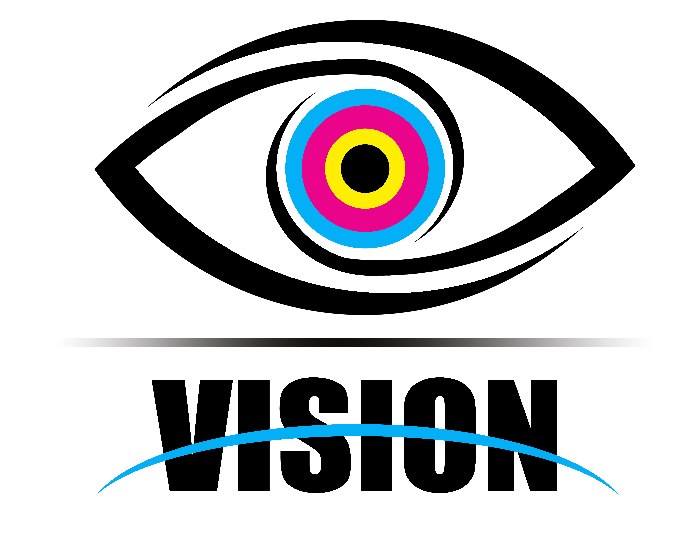

  

<h1 align="center">Vision Website</h1>

Welcome to the GitHub repository for the Vision website! This is a commercial website that was created using SvelteKit. You can access the live website at [https://visionpcl.com/](https://visionpcl.com/).

## Features

- Modern and responsive design
- Built with SvelteKit for efficient and fast performance
- Easy-to-use navigation and intuitive user interface

## Getting Started

1. Clone this repository to your local machine using `git clone https://github.com/your-username/vision-website.git`.
2. Navigate to the project directory using `cd vision-website`.
3. Install the necessary dependencies using `npm install`.
4. Start the development server using `npm run dev`.

## License

The Vision website is licensed under the Creative Commons Attribution-NonCommercial-NoDerivatives 4.0 International (CC BY-NC-ND 4.0) license. This means that you are free to share the website as long as you give appropriate credit, but you cannot use it for commercial purposes or make any changes to it without permission.

Thank you for checking out the Vision website!